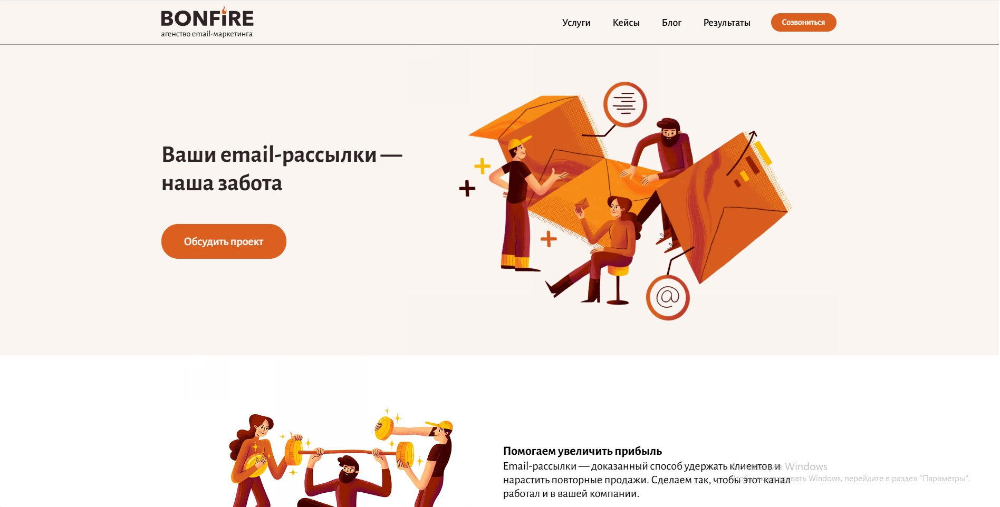
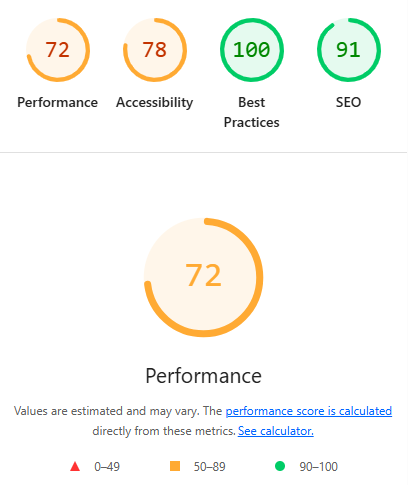
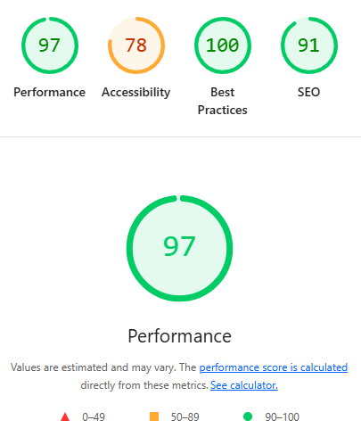

Bonfire — Агенство email-маркетинга
===
Данный проект представляет собой учебную работу по вёрстке для защиты **Контрольной работы №3** по дисциплине **Фронтенд и бэкенд разработка**.
В ходе разработки, я вдохновлялся дизайном существующего веб-сайта [Bonfire — агенство email- и CRM-маркетинга](https://bonfire.online/), а всю визуальную составляющую (макет, цветовая палитра, UI-элементы) были воссозданы из приложенного макета Figma в репозитории.

*Все права на оригинальный дизайн принадлежат их законным владельцам.*
***

